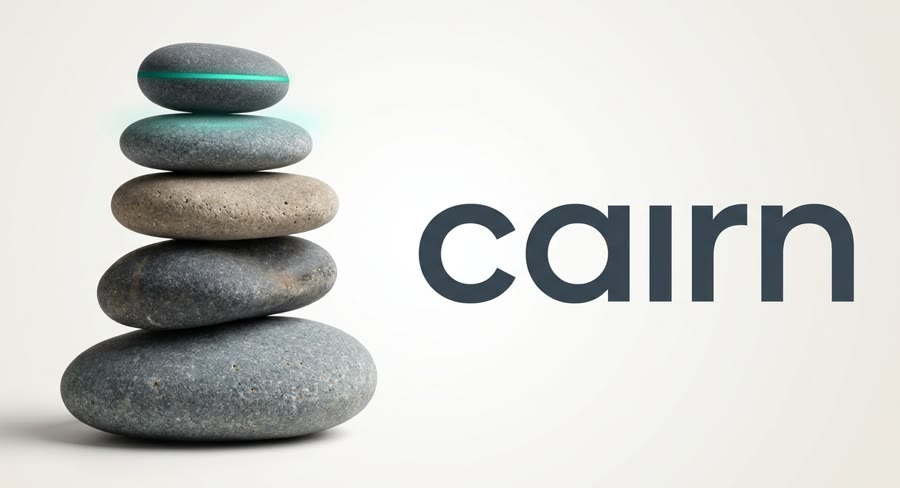

<h1 align="center"></h1>

<p align="center"><strong>A tamper-evident, community-reviewed ledger for AI agents.</strong><br>
Every change to an agent, and every consequential action taken through its gatekeeper, goes into a public log anyone can verify.<br>
Changes take effect only after delayed, human-auditable review. No blockchain framework. Standard library only.</p>

<p align="center"><a href="https://cairnframework.blogspot.com">Blog</a> · <a href="docs/assets/cairn-logo-sting.mp4">5-second logo animation</a></p>

<p align="center">
<a href="https://github.com/cockyapple/cairn/actions/workflows/ci.yml"></a>


</p>

---

## Why this exists

AI agents now read untrusted text, call tools, hold credentials and move money. Two
problems follow, and neither is solved by a better model:

1. **Silent change.** A prompt, tool list, model or permission can be altered and
   nobody can prove what changed, when, or who approved it.
2. **Manipulation.** Anything an agent reads can contain instructions. Prompt
   injection cannot be made impossible at the model level, because a model reads
   instructions and data in the same channel.

Cairn takes the honest route on both. It does not claim an agent is "unalterable"
or that a model cannot be fooled. It claims:

> **Alteration is visible, delayed, reviewed and attributable, and a manipulated
> agent can do nothing its capability grant does not already allow.**

That second half is the design goal, and today it holds only for an agent that acts through
the gatekeeper. The gatekeeper is a policy layer inside one process, not an OS sandbox, and
nothing in the log stops an agent that holds its own signing key from writing to it directly.
The status table below says what is built.

## What Cairn is

- A **transparency log** written from scratch: a hash-chained, Ed25519-signed,
  Merkle-tree-committed record of agent changes and actions, in the same family as
  Certificate Transparency and Go's checksum database, not a general smart-contract
  chain.
- A **governance process**: proposals, votes, risk tiers with timelocks, and a
  freeze, so a change to an agent takes effect only after independent review.
- A **gatekeeper design** that enforces permissions in plain deterministic code
  outside the model, so prompt injection is contained rather than merely discouraged.
- **Model-agnostic and multi-agent**: any LLM, cloud or local, and many agents at
  once, each isolated with its own key and grant.

## What Cairn is not

- Not a cryptocurrency, token or general blockchain platform.
- Not a guarantee that a model is correct or cannot be fooled.
- Not finished. See [Status](#status).

## How it fits together

```
 untrusted world                                   public, verifiable
┌────────────────┐   raw text    ┌─────────────┐
│ web, issues,   │ ────────────▶ │   READER    │  no tools, no secrets
│ code, logs     │               │   (any LLM) │
└────────────────┘               └──────┬──────┘
                                        │ schema-validated summary
                                        ▼
                                 ┌─────────────┐
                                 │    ACTOR    │  proposes tool calls
                                 │   (any LLM) │
                                 └──────┬──────┘
                                        │ structured call
                                        ▼
                                 ┌─────────────┐  1 validate  2 check grant
                                 │ GATEKEEPER  │  3 write ACTION  4 run or refuse
                                 │  (code)     │ ─────────────────────────────┐
                                 └──────┬──────┘                              ▼
                                        ▼                          ┌───────────────────┐
                                     tools                         │  CAIRN LEDGER     │
                                                                   │  hash chain       │
   proposals ─▶ reviewers vote ─▶ timelock ─▶ ACTIVATE ──────────▶ │  Merkle tree      │
                                                                   │  signed checkpoints│
                                          independent witnesses ─▶ │  witness cosigns  │
                                                                   └───────────────────┘
```

Every change follows one path: **PROPOSAL, VOTE, ACTIVATE**, with a delay set by risk
tier. Every action follows another: the gatekeeper writes an **ACTION** entry *before*
it executes.

| Tier | Examples | Minimum delay |
|------|----------|---------------|
| T0 | Tighten a limit, add a blocklist entry | none |
| T1 | Prompt wording, non-security config | 24 h |
| T2 | New tool, model swap, widened limits | 72 h |
| T3 | Permission changes, new agent role | 7 d |
| T4 | Gatekeeper code, validator set, the constitution | 14 d |

Tightening is always faster than loosening, and an agent can never vote on a change to
itself. The full list is in the [constitution](docs/CONSTITUTION.md).

## Design principles

1. **Write the protocol, never the primitives.** SHA-256 and Ed25519 from the Go
   standard library. No third-party dependencies in the core.
2. **Small trusted core.** The verifier must stay small enough to read in an afternoon
   (budget: 1,500 lines. Wire and ledger are about 1,190 lines including comments;
   governance replay adds about 650 more and is not counted against that budget yet.
   The log server, witness and note packages are likewise outside the budget.)
3. **Conformance lives in vectors, not prose.** `testdata/vectors-v1.json` is
   language-neutral, so a second implementation can prove the spec is implementable.
4. **The model is an untrusted component.** No guarantee depends on which model is
   used or on it behaving well.
5. **Be honest about what is enforced.** Commitments are labelled as commitments.
6. **Ship value before decentralization.** A single sequencer with independent
   witnesses is already useful; BFT consensus comes later.
7. **Publish the failures.** A public tamper-test log is worth more than a claim.

## Status

**Phase 0 (specification and verifier core) is done. Phases 1 and 2 are partly built.** What
exists today, and what does not, so nothing is oversold:

| | Status |
|---|---|
| Wire format, entry, chain, Merkle tree, checkpoints, quorum and witness checks | Built and tested |
| Language-neutral conformance vectors, with an independent stdlib re-derivation test | Built and tested |
| Spec, threat model, constitution, decision records | Written |
| Merkle inclusion and consistency proofs (RFC 9162), checked against Certificate Transparency reference roots | Built and tested |
| Governance replay: who may write what, tier approvals and delays, validator rotation, freeze and lift, ACTION intent trail | Built and tested (invariants I1 and I3 enforced; see SPEC section 10.5 for the rest, which is not) |
| Verifier CLI (`cmd/cairn-verify`) and fuzz targets for every decoder | Built; short fuzz runs in CI |
| Language-neutral vectors for proofs and governance | **Not yet**: Go tests only, so a second implementation has nothing to check against |
| Review workflow: proposal, council vote, activation, loader that serves only activated content (`review`, `loader`) | Built and tested, including a rejected change that the loader refuses |
| Reviewers that are LLMs, humans or scripts, interchangeable (`review.Council`) | Built and tested against fake models; no live model has voted yet |
| Provider adapters: OpenAI-compatible, Anthropic, Google, Ollama (`provider`) | Built; tested against local fakes only, **not against the live services** |
| Gatekeeper: capability policy, intent logged before the action, refusals logged, only activated config runs, typed message bus (`gatekeeper`) | Built and tested. It is a policy layer in one process, **not an OS sandbox**: a compromised agent process is not contained |
| Static review page and eval result hashing (`cmd/cairn-review`, `eval`) | Built. The log records which eval result reviewers saw, not that the eval ran honestly |
| Per-agent OS sandbox | **Not yet** |
| Emergency revocation of agent and proposer keys (`REVOKE`) | **Built** (SPEC 10.3.1) |
| Per-agent request budget in the gatekeeper (`RateLimit`, opt-in) | **Built**; counts beyond the first refusal per window are logged in aggregate |
| Human-review pause for marked actions in the gatekeeper (`Review`, `Decide`) | **Built**; signed decision is logged in the completion blob, not enforced by the replay |
| Session taint tracking in the gatekeeper (`Untrusted`, `Guard`, `ResetTaint`) | **Built**; per session, not per value, in memory only, and a lie from a trusted channel is not caught |
| C2SP signed-note rendering of the checkpoint (`note`, `cairn-verify -note`), docs/SPEC-NOTE.md | **Built**; checked against the spec's own example only, never against a live witness; tile serving and the witness protocol are **not** built |
| Log server (`logserver`, `cairn-logd`, docs/LOG-SERVER.md): admission checks, durable append, proofs, per-author rate and size caps, checkpoint signature aggregation | **Built (slice 1)**; single process, replay is O(n) per append, no TLS or read authentication of its own, never run under load or in production |
| Independent witness (`witness`, `cairn-witness`, docs/WITNESS.md): reads the whole log, replays governance itself, cosigns only extensions of what it signed before, refuses forks and shrinking | **Built (slice 1)**; tested against a hostile server in-process, never run on a second real machine; no gossip between witnesses, no TLS, replay is O(n) per cycle |
| C2SP witness protocol and tile serving | **Not yet**: rest of Phase 1 |
| Crash durability of the log server and witness (fsync of files and parent directories) | Reasoned and reviewed, **not fault-injection tested**: no power-cut or kill-at-every-syscall harness exists |
| Gatekeeper and gate state, partial checkpoint signatures, witness replay | In memory; a restart loses them (the log and the witness's state file are durable) |
| BFT consensus | **Not yet**: Phase 4 |
| Injection benchmark, model scoring, attestation | **Not yet**: Phase 5 |

A chain that passes the verifier is **authentic and untampered**. With the governance
replay it is also checked for the rules in SPEC section 10, which cover roles, tiers,
delays, freezes and ACTION ordering. It is not checked for the semantic rules (I4) or
for anything about what a gatekeeper or agent actually did. Entry times are advisory.
Do not treat it as more than that.

## Roadmap

| Phase | Weeks | Delivers | Standalone value |
|------:|------:|----------|:---:|
| 0 | 1 to 2 | Spec, threat model, constitution, verifier core, vectors | yes |
| 1 | 3 to 6 | Append-only log server, inclusion and consistency proofs, verifier CLI, witness, governance state machine | yes |
| 2 | 7 to 10 | Proposals, votes, tiers, timelocks, freeze, review UI, eval runner; **gatekeeper and provider adapters** | yes |
| 3 | 11 to 14 | First governed agent; fleet budgets, spawn limits, message bus | yes |
| 4 | 15 to 22 | Custom BFT (3f+1), specified in TLA+ and tested by deterministic simulation | research |
| 5 | 23 to 30 | Attestation, injection corpus and benchmark, per-model scoring, hardening | research |

Phases 0 to 3 are useful with a single operator. Phases 4 and 5 are research-grade and
can slip without breaking what came before. Details and the plan page are in
[docs/DECISIONS.md](docs/DECISIONS.md) and [ROADMAP.md](ROADMAP.md).

## Quick start

Go is not required on your machine; tooling runs in a pinned container. If you do have
Go 1.24, run the `go` commands directly.

```sh
git clone https://github.com/cockyapple/cairn.git && cd cairn
make test        # unit tests, vector tests, independent stdlib re-derivation
make vet
make vectors     # regenerate the golden file (a spec change: review the diff)
make loc         # verifier size against the 1,500-line budget
```

Verify a chain in code:

```go
entries, err := ledger.DecodeChain(encodedEntries) // strict decode + chain rules
sc, err := ledger.DecodeSignedCheckpoint(checkpointBytes)
err = ledger.VerifyLog(entries, &sc, &trust)       // chain + quorum + witnesses
if ledger.ErrCode(err) == ledger.CodeBelowQuorum { /* ... */ }
```

Or from files, with the governance rules checked as well:

```sh
go run ./cmd/cairn-verify -entries log.bin -blobs payloads/ -checkpoint cp.bin
# ok chain: ...   ok governance: ...   ok checkpoint: ...   (exit 0)
# FAIL unauthorized_author: ...                              (exit 1)
```

Errors carry stable string codes (`bad_signature`, `below_quorum`, ...) that the
vectors assert exactly, so another language can match them.

## Repository map

| Path | What |
|------|------|
| [`docs/SPEC.md`](docs/SPEC.md) | Wire format and verification rules, v1 |
| [`docs/THREAT-MODEL.md`](docs/THREAT-MODEL.md) | Assets, adversaries, mitigations and their status |
| [`docs/CONSTITUTION.md`](docs/CONSTITUTION.md) | Change tiers and the twelve invariants |
| [`docs/INJECTION-DEFENSE.md`](docs/INJECTION-DEFENSE.md) | How prompt injection is contained |
| [`docs/MODELS-AND-FLEETS.md`](docs/MODELS-AND-FLEETS.md) | Any LLM, and many agents at once |
| [`docs/DECISIONS.md`](docs/DECISIONS.md) | Architecture decision records |
| [`docs/EVIDENCE.md`](docs/EVIDENCE.md) | Raw test and mutation-run outputs, how to reproduce them, and what they do not show |
| `wire/` | Strict canonical binary reader and writer |
| `ledger/` | Entries, chain, Merkle tree, trust config, checkpoints, verification |
| `internal/vectorgen`, `cmd/cairn-vectors` | Deterministic vector generator |
| `testdata/vectors-v1.json` | Conformance vectors |

## FAQ

**Is this a blockchain?** It is a cryptographic, append-only, publicly verifiable log
with a planned BFT validator set, but it has no token and is not built on a blockchain
framework. The word fits loosely; "transparency log" is more accurate.

**Can the AI really not be altered?** No. Nothing can promise that. Cairn makes any
alteration visible, delayed, reviewed and attributable.

**Can you stop prompt injection?** Not at the model level, and nobody can. Cairn makes
it structurally ineffective: authority is enforced by a deterministic gatekeeper outside
the model, untrusted text is treated as data, risky acts need human approval, and a
measured attack corpus gates every change. Read
[INJECTION-DEFENSE.md](docs/INJECTION-DEFENSE.md) for the full design and its limits.

**Which models work?** Any, cloud or local, through a small adapter (OpenAI-compatible
servers, Anthropic, Google, Ollama). A model with no measured injection score gets the
minimum grant.

**Why not use an existing chain or framework?** The goal is a small verifier that one
person can read, with no dependencies to audit. A general smart-contract platform is far
more surface than a transparency log needs.

## Safety notes

- Test keys are derived from public seeds and **must never be used for anything real**.
- Report vulnerabilities privately, see [SECURITY.md](SECURITY.md).

## Contributing

Start with [CONTRIBUTING.md](CONTRIBUTING.md). The most valuable early contributions
are: a second-language verifier that passes the vectors, adversarial review of the spec,
and injection attack cases.

## License

Apache 2.0, see [LICENSE](LICENSE).
